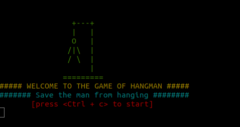

# HangMan
[](https://badge.fury.io/py/hangman-ultimate)
[](https://pepy.tech/project/hangman-ultimate)
[](https://pepy.tech/project/hangman-ultimate/month)
[](https://pepy.tech/project/hangman-ultimate/week)

A character user interface of the popular game hangman.


## Features
- Play directly in the terminal with colourful ASCII graphics.
- Choose from multiple word lists: Animals, Pokemons, Fruits, Countries and Bollywood Movies.
- Available as a command line tool after installation.

## Installation
```bash
pip install hangman-ultimate
```

## Usage
Start the game from anywhere using the console script:
```bash
hangman-ultimate
```
Or run the runner file directly:
```bash
python hangman-runner.py
```



## Contributing
Contributions are welcome! See [CONTRIBUTING.md](CONTRIBUTING.md) for setup and guidelines.

## Changelog
Detailed release notes are available in [CHANGELOG.md](CHANGELOG.md).

Find the tutorial for the project on my [blog](https://attackonalgorithms.wordpress.com/2019/10/24/slightly-non-trivial-implementation-of-cli-hangman-a-hands-on-python-tutorial/).
